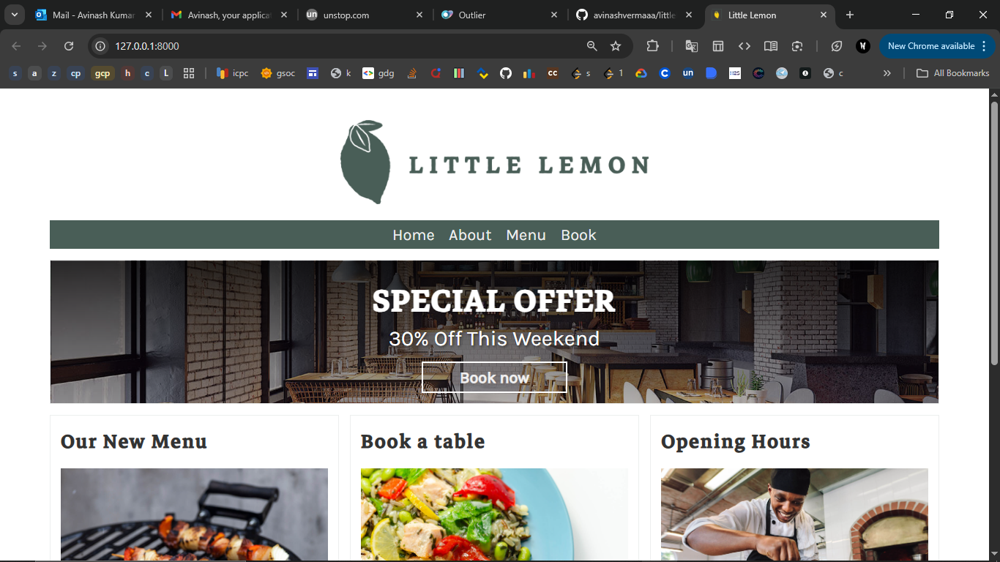
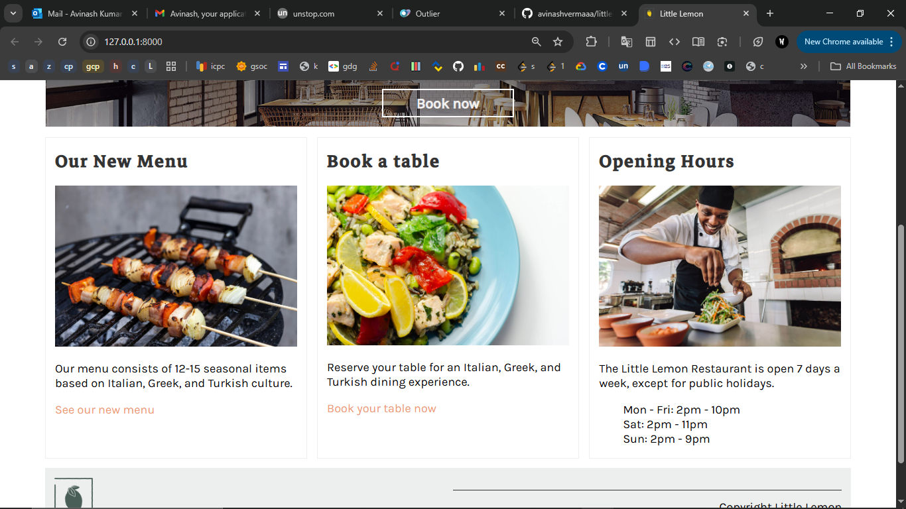
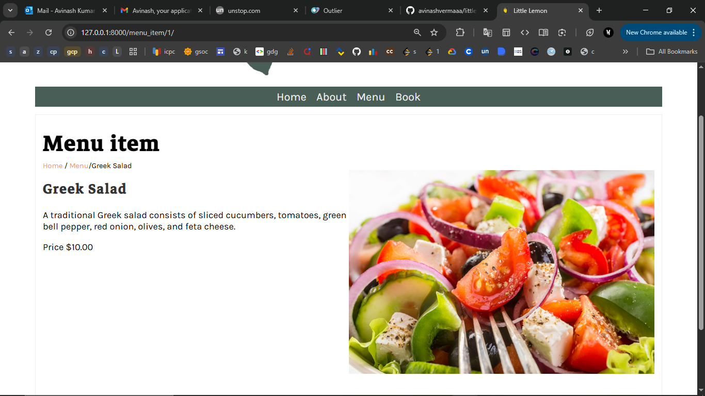
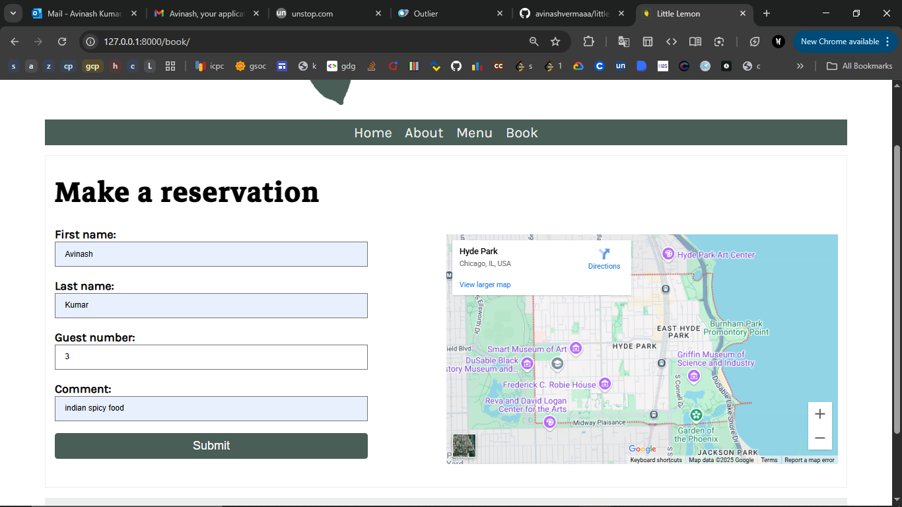
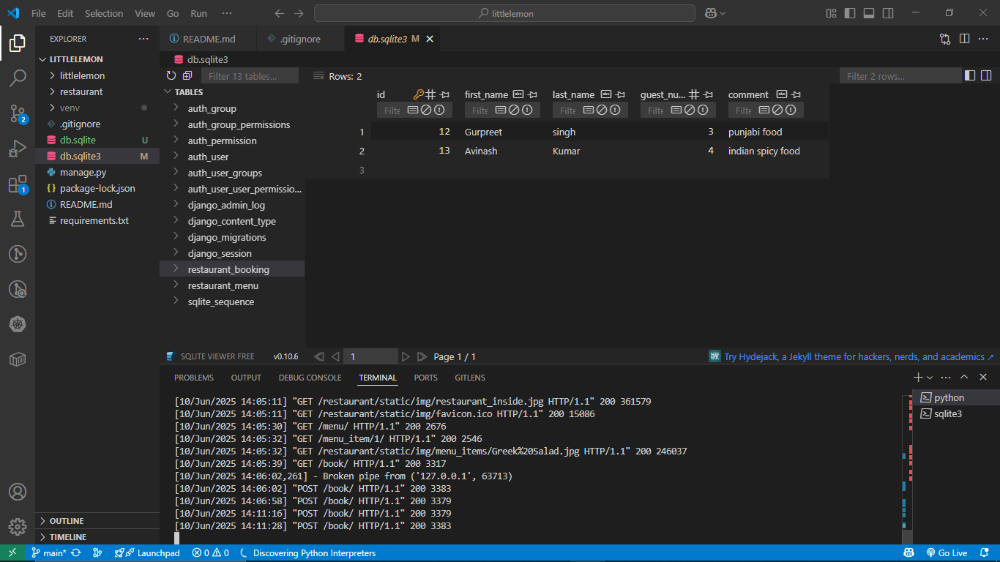

# LittleLemon - Restaurant Table Booking Web App

**LittleLemon** is a modern web application designed for customers to effortlessly book tables at a restaurant. It provides a simple and intuitive interface for users to check real-time availability, view the menu, and reserve tables—all within a few clicks.

## Key Features

- **Simple Table Booking**: Users can select a date, time, and number of guests to easily reserve a table.
- **Real-Time Availability**: The app displays available tables in real-time, so customers only book when a table is free.
- **Menu Display**: Customers can browse the full restaurant menu with pricing and descriptions.
- **Responsive Design**: Fully optimized for both desktop and mobile devices.
- **Order History**: Keeps track of past reservations for easy reference.

### Explanation of the Technologies Used Section:

1. **Frontend:**
   - **HTML5**: It's the core markup language for structuring content.
   - **CSS3**: Provides the styling, layout, and responsiveness for the web pages.

2. **Backend:**
   - **Python**: It's the programming language used to handle the business logic of the app.
   - **Django**: A high-level Python web framework that simplifies web development by providing built-in features like routing, authentication, and database management.

3. **Database:**
   - **SQLite**: An embedded database used to store application data. It's light and works well for small to medium-sized projects.

---

## Screenshots

### Homepage


### Menu, Book Table, Open hours


### Menu items


### Reservation page


### Reservation record in database



# run server 
* cd to dir. --> on terminal run --> 
``` 
python manage.py runserver
```
# make a booking
* go to book page --> add details --> make a booking

# open database on vs code terminal
# open restaurant_booking under tables
* cd to dir. --> on terminal run -->
```
python manage.py dbshell

        or

sqlite3 db.sqlite3
```
* It will open sql in terminal Then run sql commands  :-
```
DELETE FROM restaurant_booking WHERE first_name = 'Avinash';
```
```
.exit (to exit sql)
```

```
netstat -ano | findstr :8000

        output :- 
        TCP    127.0.0.1:8000     0.0.0.0:0     LISTENING       12345

taskkill /PID 12345 /F
Replace 12345 with your actual PID.
```

```
use requirements.txt
pip install -r requirements.txt

in terminal :-
venv\bin\activate
pip show django 
pip install -r requirements.txt
python manage.py migrate
python manage.py runserver

sqlite3 db.sqlite3
deactivate
```